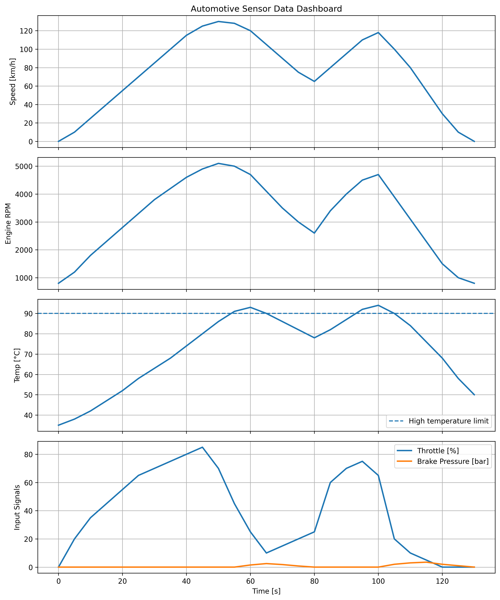

# Automotive Data Analysis with Python

## Overview

This project analyzes simulated automotive sensor data using Python.

It reads vehicle data from a CSV file, validates the dataset, calculates engineering statistics, detects warning conditions, creates visualizations, and generates an automated technical report.

The project is relevant for automotive engineering, mechatronics, data analysis, testing, validation, and vehicle performance evaluation.

## Main Features

- Reads automotive sensor data from a CSV file
- Validates required columns and numeric values
- Sorts the dataset by time
- Detects duplicate or incorrect time values
- Calculates acceleration from vehicle speed and time
- Analyzes vehicle speed, engine RPM, battery voltage, and motor temperature
- Detects high motor temperature warnings
- Detects low battery voltage warnings
- Detects high-speed events
- Detects hard acceleration and hard braking events
- Generates separate signal plots
- Generates a dashboard-style overview plot
- Creates an automated engineering report

## Technologies Used

- Python
- pandas
- matplotlib
- CSV data analysis
- Automotive sensor data
- Data validation
- Warning detection
- Engineering visualization
- Automated reporting

## Repository Structure

```text
automotive-data-analysis-python/
│
├── automotive_analysis.py
├── vehicle_data.csv
├── README.md
├── requirements.txt
├── .gitignore
├── screenshots/
│   └── automotive_dashboard.png
└── outputs/
    ├── automotive_report.txt
    ├── speed_plot.png
    ├── rpm_plot.png
    ├── temperature_plot.png
    ├── battery_plot.png
    ├── throttle_brake_plot.png
    └── automotive_dashboard.png
```

## Input Data

The project uses a CSV file named:

```text
vehicle_data.csv
```

The dataset contains simulated automotive sensor values.

| Column | Description |
|---|---|
| `time_s` | Time in seconds |
| `vehicle_speed_kmh` | Vehicle speed in km/h |
| `engine_rpm` | Engine speed in revolutions per minute |
| `throttle_percent` | Throttle position in percent |
| `brake_pressure_bar` | Brake pressure in bar |
| `battery_voltage_v` | Battery voltage in volts |
| `motor_temperature_c` | Motor temperature in degrees Celsius |

## Analysis Logic

### Data Validation

Before the analysis starts, the script checks that:

- the CSV file exists
- all required columns are available
- all required values are numeric
- time values are sorted correctly
- time values do not repeat or go backwards

This makes the project closer to a real engineering data workflow.

### Acceleration Calculation

Acceleration is calculated from speed and time data.

The script converts speed from km/h to m/s and then calculates the acceleration between time steps.

### Warning Detection

The script detects warning conditions using simple engineering limits.

| Condition | Limit |
|---|---|
| High motor temperature | `motor_temperature_c > 90` |
| Low battery voltage | `battery_voltage_v < 12.0` |
| High speed event | `vehicle_speed_kmh > 100` |
| Hard acceleration | `acceleration_mps2 > 2.5` |
| Hard braking | `acceleration_mps2 < -3.0` |

## Generated Output

After running the script, the following files are generated in the `outputs/` folder:

- `outputs/automotive_report.txt`
- `outputs/speed_plot.png`
- `outputs/rpm_plot.png`
- `outputs/temperature_plot.png`
- `outputs/battery_plot.png`
- `outputs/throttle_brake_plot.png`
- `outputs/automotive_dashboard.png`

## Example Output

### Automotive Dashboard



## How to Run

Install the required libraries:

```bash
pip install -r requirements.txt
```

Run the analysis script:

```bash
python automotive_analysis.py
```

Expected terminal output:

```text
Automotive analysis completed successfully.
Report saved as: outputs/automotive_report.txt
Plots saved in: outputs
```

## Skills Demonstrated

- Python programming
- CSV data handling
- Data validation
- Automotive sensor data analysis
- Engineering calculations
- Acceleration calculation
- Warning detection
- Data visualization with matplotlib
- Automated technical report generation

## What I Learned

- How to analyze automotive sensor data with Python
- How to work with CSV datasets using pandas
- How to validate input data before analysis
- How to calculate acceleration from speed and time data
- How to visualize vehicle signals using matplotlib
- How to detect warning conditions from sensor values
- How Python can support automotive and mechatronics workflows

## Possible Applications

- Automotive data analysis
- Vehicle performance evaluation
- Sensor data monitoring
- Engineering test reports
- Mechatronics projects
- Embedded systems data analysis
- Internship portfolio project for automotive companies

## Future Improvements

- Add real vehicle data
- Add CAN bus data analysis
- Add OBD-II data support
- Add battery performance analysis
- Add electric vehicle data analysis
- Add dashboard visualization with Streamlit
- Add PDF report generation
- Add comparison between different driving cycles
- Add machine learning for anomaly detection

## Project Status

This project was created as a Python engineering portfolio project focused on automotive data analysis, warning detection, visualization, and automated reporting.
